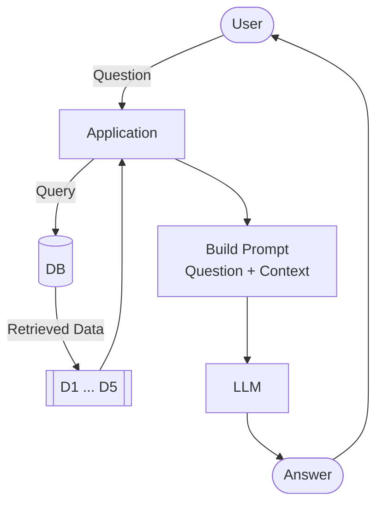

# RAG

Video: [Watch this lesson](https://www.youtube.com/watch?v=JktYwBIDErk&list=PL3MmuxUbc_hLZFNgSad56pDBKK8KO0XIv)

We run free Zoomcamp courses at DataTalks.Club on data engineering,
machine learning, MLOps, and other topics. Each course has its own
FAQ document with common questions and answers.

Some of these documents have over 300 questions. Students ask us
things in Slack like "Can I still join after the course started?" or
"How do I get a certificate?" Finding those answers in the FAQ is
tedious.

We want a bot that takes all this knowledge and answers student
questions in natural language.

In this module, we'll build that system. But first, let's see why we
can't send the question straight to an LLM and call it a day.

## Plain LLMs lack our data

First, let's define a function to talk to the LLM:

```python
def llm(prompt):
    response = openai_client.responses.create(
        model="gpt-5.4-mini",
        input=prompt
    )
    return response.output_text
```

This is our black box - text goes in, text comes out.

Let's test it:

```python
llm("Hey, what's up?")
```

It replies with something. The LLM works.

Ask it a course-specific
question:

```python
question = "I just discovered the course. Can I join now?"
answer = llm(question)
print(answer)
```

The LLM gives a generic answer. It might say "you can usually join" or
"check the course website." It doesn't know about our specific Zoomcamp
courses, their enrollment policies, or their schedules. It tries to be
helpful, but has no idea about actual enrollment status or policies.

This is different from a question like "how do I cook salmon?" - the
LLM knows the answer because cooking salmon is common knowledge. But
our courses are not in the training data.

## Adding context manually

More context can fix this. The FAQ website has questions and answers
about our courses.

Copy some of that content into the prompt:

```python
context = """
I just discovered the course. Can I still join?
Yes, but if you want to receive a certificate, you need to submit your project while we're still accepting submissions.

Course: I have registered for the LLM Zoomcamp. When can I expect to receive the confirmation email?
You don't need it. You're accepted. You can also just start learning and submitting homework (while the form is open) without registering. It is not checked against any registered list. Registration is just to gauge interest before the start date.

What is the video/zoom link to the stream for the "Office Hours" or live/workshop sessions?
The zoom link is only published to instructors/presenters/TAs. Students participate via YouTube Live and submit questions to Slido.

Cloud alternatives with GPU
Check the quota and reset cycle carefully. Potential options include Google Colab, Kaggle, Databricks.
"""
```

Notice the prompt doesn't end with `Answer:`. With older models like
GPT-3 we added that to nudge the model into completing the sentence.
Modern models don't need the hint, so we drop it.

Build a prompt that includes both the question and the context:

```python
prompt = f"""
Your task is to answer questions from the course participants
based on the provided context.

Use the context to find relevant information and provide accurate
answers. If the answer is not found in the context,
respond with "I don't know."

Question:
{question}

Context:
{context}
"""
```

Instead of sending the raw question to the LLM, we send this prompt:

```python
answer = llm(prompt)
print(answer)
```

After that, the answer is correct: "Yes, you can still join. If you want to
receive a certificate, you need to submit your project while
submissions are still open."

This is the answer we actually want to give to our students. What we
just did is nothing but RAG.

## Retrieval plus generation

RAG stands for Retrieval-Augmented Generation. Generation is the LLM
producing text, and retrieval is search. We retrieve relevant documents
from our knowledge base and use them to augment what the LLM generates.
That search step is what gives the LLM the context it needs to answer
correctly.

What we just did was naive. I knew in advance which FAQ entry held the
answer and pasted it in by hand. What we want instead is to perform
search automatically. We take the student's question, find the most
relevant documents, and send those to the LLM.

In code, it looks like this:

```python
def rag(question):
    search_results = search(question)
    user_prompt = build_prompt(question, search_results)
    return llm(user_prompt)
```

That's the entire architecture. It comes down to three components.

The pieces are search, the prompt, and the LLM:

- search
- prompt
- LLM




The LLM only sees the documents we hand it, so its answers are grounded
in our data. If the right document is retrieved, the answer is good. If
it's not, the LLM gets the wrong context and the answer is wrong. Your
model is only as good as your retrieval, so search quality matters a
lot for RAG.

The database and the LLM can be anything. In this course we use
minsearch and then sqlitesearch for search, and OpenAI for the LLM. But
you can swap any component for another and see what works better.

Because each piece is independent, RAG stays flexible. To use Anthropic
instead of OpenAI, you swap the LLM call. To use Elasticsearch instead
of minsearch, you swap the search call. Nothing else changes.

In the next section, we'll look at the dataset we'll use for our FAQ
knowledge base.

[← Environment](02-environment.md) | [The Course FAQ Dataset →](04-dataset.md)
