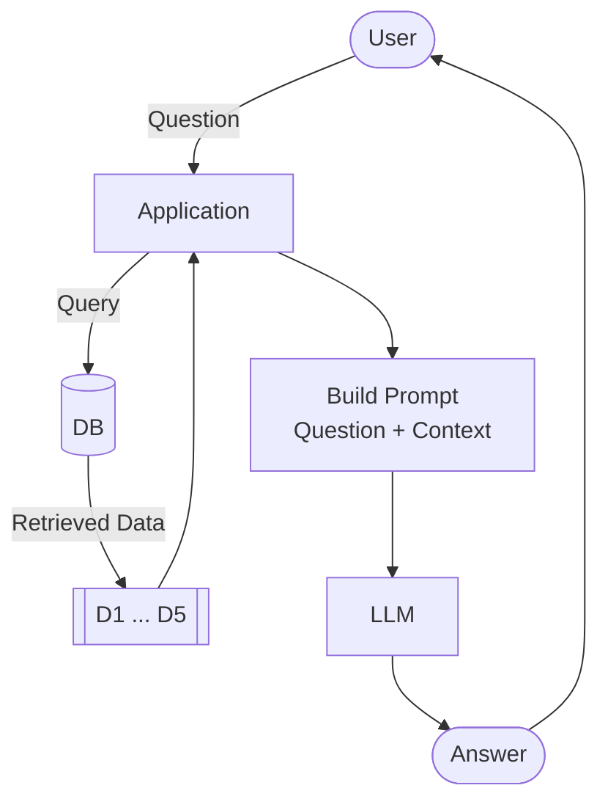

# The LLM

Video: [Watch this lesson](https://www.youtube.com/watch?v=KHePGkeFn54&list=PL3MmuxUbc_hLZFNgSad56pDBKK8KO0XIv)

The last component of our RAG pipeline is the LLM. It takes
the prompt we built and generates an answer.

## Sending the prompt to the LLM

We have the prompt from the previous section.

We send it to the
LLM:

```python
response = openai_client.responses.create(
    model="gpt-5.4-mini",
    input=prompt
)
```

We use OpenAI's Responses API (`openai_client.responses.create`). OpenAI
has two APIs: chat completions and responses. Chat completions is the
older one, and it's now considered legacy. When the first edition of
this course started, the Responses API didn't exist, so we used chat
completions. Now we prefer responses because it's more convenient.

There's a catch worth knowing. Many other providers like Groq and
Gemini give you an OpenAI-compatible client. But they expose chat
completions, not responses. So if you switch providers, you keep the
OpenAI client but call `chat.completions` instead of `responses`.

## Exploring the response

The response is a Pydantic object. The answer is in `response.output` -
a list of output items.

The first one is the message:

```python
response.output[0]
```

The message has a `content` list, and the text is in the first item:

```python
response.output[0].content[0].text
```

That's quite a journey to reach one string.

The shortcut spares us all of it:

```python
response.output_text
```

Same result, less code. The answer should be something like: "Yes, you
can still join. If you want to receive a certificate, make sure to
submit your project while submissions are still open."

The usage counts tell you how many tokens the request consumed:

```python
response.usage
```

You'll see something like:

```text
ResponseUsage(input_tokens=334, output_tokens=39, total_tokens=373)
```

## Calculating the price

You can use different models.

In this course we'll use
[gpt-5.4-mini](https://developers.openai.com/api/docs/models/gpt-5.4-mini):

- Input: $0.75 per million tokens
- Output: $4.50 per million tokens

Let's calculate the cost of the request we just made:

```python
input_price = 0.75 / 1_000_000
output_price = 4.50 / 1_000_000

cost = (
    response.usage.input_tokens * input_price +
    response.usage.output_tokens * output_price
)

cost
```

This particular request costs a fraction of a cent. Even a full RAG
query with a long prompt stays under $0.01. We need to send a lot of
queries to even spend one cent. These models are cheap to play with.

The usage object also reports cached input tokens. Those are billed at
a lower rate when the same prompt prefix repeats.

## Message history

Previously we sent only one string as input and got back a response.
In practice, you typically send a message history - a list of messages
where each message has a role.

Think of a ChatGPT conversation. It starts with a hidden system prompt
that tells the LLM how to behave, one you never see. After that, your
messages and the LLM's replies alternate. The LLM has no memory of its
own, so it needs the full history passed in to continue the
conversation.

We won't build a multi-turn chat here. But we still use this message
format to separate our instructions from the user prompt.

We send two messages:

- `developer` - system-level instructions (how the LLM should behave)
- `user` - the actual prompt with the question and context

```python
message_history = [
    {"role": "developer", "content": INSTRUCTIONS},
    {"role": "user", "content": prompt}
]

response = openai_client.responses.create(
    model="gpt-5.4-mini",
    input=message_history
)
```

This separates the fixed instructions from the user prompt, which
changes every request.

OpenAI accepts both `developer` and `system` for the instruction role.
There may be some difference between them, but in practice I don't see
it change the result either way. We use `developer` in this course.

## The LLM function

We can now put this together into an updated `llm` function.

It now
takes both instructions and the user prompt:

```python
def llm(instructions, user_prompt, model="gpt-5.4-mini"):
    message_history = [
        {"role": "developer", "content": instructions},
        {"role": "user", "content": user_prompt}
    ]

    response = openai_client.responses.create(
        model=model,
        input=message_history
    )

    return response.output_text
```

## Full RAG

With search, the prompt, and the LLM ready, we wire them together:

```python
def rag(query, model="gpt-5.4-mini"):
    search_results = search(query)
    prompt = build_prompt(query, search_results)
    answer = llm(INSTRUCTIONS, prompt, model=model)
    return answer
```

The revised architecture:



Try it:

```python
answer = rag("I just discovered the course. Can I join now?")
print(answer)
```

The answer should be based on the FAQ documents - not on the LLM's
general knowledge. The LLM read the search results and generated a
response grounded in our data.

## Try more questions

Try a few more:

```python
rag("How do I get a certificate?")
```

Notice how the answers reference specific courses and sections. The
LLM reads from our knowledge base before answering - that's how RAG
works.

This approach is modular. You can swap the search backend, the prompt
template, or the LLM model. Nothing else needs to change. Later when
we replace minsearch with sqlitesearch, only the `search` function
changes.

Code: [notebook.ipynb](../code/notebook.ipynb)

[← Building the Prompt](06-building-prompt.md) | [RAG Helper →](08-rag-helper.md)
