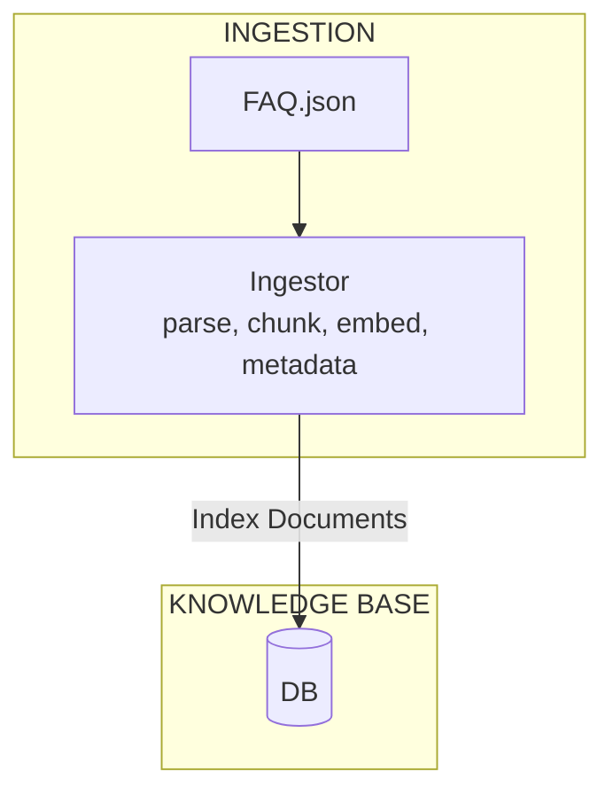
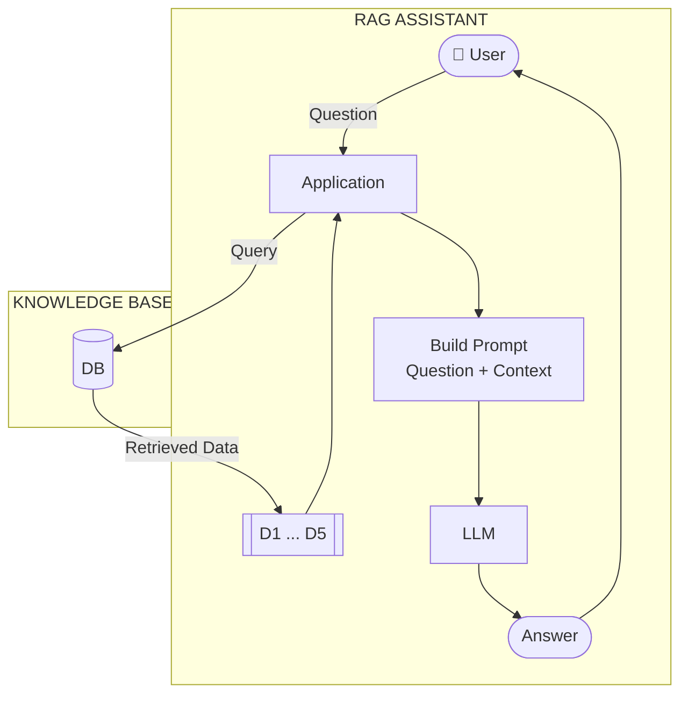

# Data Ingestion

Video: [Watch this lesson](https://www.youtube.com/watch?v=e0owGI2JV-s&list=PL3MmuxUbc_hLZFNgSad56pDBKK8KO0XIv)

So far, our RAG pipeline loads data and builds the search index at
startup. With minsearch, this is fine - our FAQ dataset is small, so
indexing takes less than a second. The entire pipeline runs in one
process.

This breaks down as the dataset grows. Fetching data takes time -
calling APIs, parsing files, cleaning text. With millions of
documents, the startup becomes slow. You don't want to wait minutes
every time your service restarts.

Minsearch is in-memory. It's a bunch of Python dictionaries bound to
the process where it's running. When you stop the process, the data
disappears, so you re-index every time you restart. That's wasteful if
indexing is slow or the data takes time to prepare.

So we separate ingestion from querying. One process writes the data to
a persistent search index. Another process reads from it. The two run
independently and only share the index between them.

The index survives restarts, so we ingest once and query as often as
we like. This is the ingestion step from data engineering. We move data
from its source into a target system the application can use.

You can use any persistent search backend for this, such as
Elasticsearch, OpenSearch, or Qdrant. In this module, we use
[sqlitesearch](https://github.com/alexeygrigorev/sqlitesearch), a
lightweight search library backed by SQLite FTS5. It has the same API
as minsearch, so it's a drop-in replacement that happens to be
persistent.

I picked SQLite because it asks nothing of you. It ships with Python,
so you don't add any dependency, and it has FTS5 (full text search)
built in. If you have Python, you already have a full text search
engine. Using FTS5 directly is a bit awkward, so I wrote sqlitesearch
as a convenient wrapper around it.

You can read more about the history of this library [here](https://alexeyondata.substack.com/p/how-i-built-sqlitesearch-a-lightweight).

Install it:

```bash
uv add sqlitesearch
```

## Ingestion notebook

Create a new notebook called `sqlite-ingest.ipynb` (see [persistent_rag_ingest.ipynb](../code/persistent_rag_ingest.ipynb) for reference). This is the
ingestion process - it fetches data and writes it to a persistent
index.

First, load the data using the function from `ingest.py`:

```python
from ingest import load_faq_data

documents = load_faq_data()
print(f"Loaded {len(documents)} documents")
```

Filter to just the LLM Zoomcamp documents:

```python
docs_llm = [doc for doc in documents if doc["course"] == "llm-zoomcamp"]
print(f"LLM Zoomcamp: {len(docs_llm)} documents")
```

Now create a sqlitesearch index and add documents one by one with a
small delay (to simulate slow ingestion):

```python
import time
from sqlitesearch import TextSearchIndex

index = TextSearchIndex(
    text_fields=["question", "section", "answer"],
    keyword_fields=["course"],
    db_path="faq.db"
)

for doc in docs_llm:
    index.add(doc)
    print(f"""Added: {doc["question"][:60]}...""")
    time.sleep(0.5)

index.close()
print("Done. Index saved to faq.db")
```

Run this notebook. You'll see each document being added one by one.
When it's done, there's a `faq.db` file on disk with the entire index.
This file persists across restarts.

## Querying notebook

While the ingestion is running (or after it finishes), create another
notebook (see [persinsent_rag.ipynb](../code/persinsent_rag.ipynb) for reference).

Connect to the same database:

```python
from sqlitesearch import TextSearchIndex

sqlite_index = TextSearchIndex(
    text_fields=["question", "section", "answer"],
    keyword_fields=["course"],
    db_path="faq.db"
)
```

Check how many documents are in the index:

```python
sqlite_index.count()
```

Run this cell a few times while the other notebook is still ingesting.
You'll see the number growing as ingestion progresses. This is normal
database behavior: one process writes, another reads, both at the same
time. With minsearch this is impossible, because the index lives in one
process's memory and nobody else can reach it.

Try a search:

```python
results = sqlite_index.search("Can I still join the course after it started?", num_results=5)
[doc["question"] for doc in results]
```

## RAG with sqlitesearch

We use the `RAGBase` class from `rag_helper.py` with this sqlitesearch
index.

Because our RAG is modular, we just swap the search index - the
rest of the code stays the same:

```python
from rag_helper import RAGBase
from openai import OpenAI
from dotenv import load_dotenv

openai_client = OpenAI()
load_dotenv()

assistant = RAGBase(
    index=sqlite_index,
    llm_client=openai_client,
)
```

This code skips both the `fit` call and the data loading. The index
is already populated by the ingestion notebook, so we just connect to
the database file.

Try it:

```python
answer = assistant.rag("Can I still join the course after it started?")
print(answer)
```

The answer should be similar to what we got with minsearch. But now the
data comes from a persistent index - no fetching, no processing, no
indexing at startup. And we didn't have to rewrite any of the RAG
logic - just swapped the index.

The modular design splits the work cleanly:

- `ingest.py` handles data loading and indexing
- `rag_helper.py` handles the RAG pipeline
- the notebooks wire them together

This works because sqlitesearch follows the same API as minsearch -
both have a `search` method that takes a query, `boost_dict`,
`filter_dict`, and `num_results`. If the API were different, we'd
need to subclass `RAGBase` and override the `search` method to adapt
to the new backend.

## Comparing the two approaches

With minsearch (single process):

```text
Startup: fetch data -> parse -> index -> ready
Every restart: repeat all steps
```

With sqlitesearch (two processes):

```text
Ingestion (runs once): fetch data -> parse -> write to faq.db
Query (runs every time): open faq.db -> search -> ready
```

The full architecture:



The ingestion process writes documents to the knowledge base.

The RAG assistant then reads from it:



For our FAQ dataset, both produce good results. The difference
matters more at scale with diverse document lengths.

## Choosing an approach

Pick the right tool for your data:

- `minsearch`: single process, in-memory only, re-indexes on every
  startup. Use when data is small and indexing is fast.
- `sqlitesearch`: separate ingestion and query, file-based (SQLite),
  opens existing index. Use when data is large or ingestion is slow.

Use minsearch when you can load and index the data on startup without
noticeable delay. Switch to a persistent backend when ingestion takes
too long or when you need the index to survive restarts.

For larger production systems, use the same pattern with a different
backend:

- Elasticsearch
- OpenSearch
- Qdrant (vector database)
- Weaviate (vector database)

The architecture stays the same: one process ingests, another queries.

## Cleaning up

When you're done, close the database connection:

```python
sqlite_index.close()
```

Or just let Python clean it up when the notebook kernel shuts down.

Code: [persistent_rag_ingest.ipynb](../code/persistent_rag_ingest.ipynb) | [persinsent_rag.ipynb](../code/persinsent_rag.ipynb)

[← RAG Helper](08-rag-helper.md) | [Wrap-up of Part 1 →](10-rag-next-steps.md)
