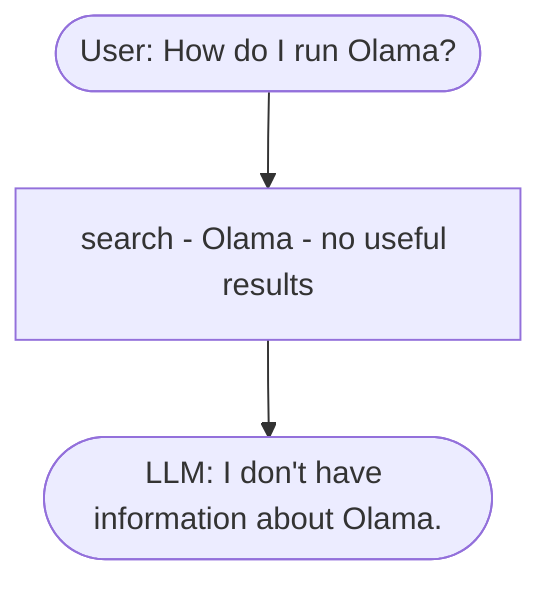
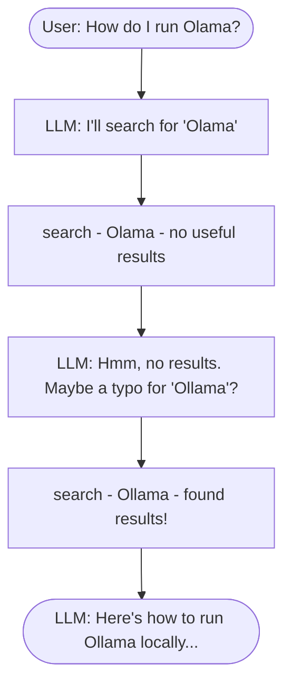

# Function Calling

In the previous lesson we built a RAG pipeline with `RAGBase.rag()`
and saw it fail on the "Olama" typo. The search returned nothing
useful, and the LLM had no way to recover.

The flow that broke:



The pipeline is fixed: search, build prompt, LLM.

```python
def rag(self, query):
    search_results = self.search(query)
    prompt = self.build_prompt(query, search_results)
    answer = self.llm(prompt)
    return answer
```

The LLM is a passenger, not a driver. It never sees the bad search
results, so it can't try again with a corrected query.

## The agent alternative

An agent puts the LLM in charge.

Instead of running search ourselves, we give the LLM a `search` tool
and let it decide when (and what) to call.

The same typo question now goes like this:



The LLM searched, saw the results were bad, and decided to try again
with a different query. It made this decision on its own. We didn't
write code to handle typos.

The key difference is about who makes the decisions:

- RAG: the developer decides. The pipeline is fixed. Search always
  runs once, with the exact user query.
- Agent: the LLM decides. It chooses which actions to take and when to
  stop.

The mechanism that makes this possible is function calling - that's
what the rest of this lesson is about.

## Asking without tools

First, see what the LLM does without any tools. We ask it a
course-specific question and see the answer.

```python
messages = [
    {'role': 'user', 'content': 'I just discovered the course. Can I join it?'}
]

response = openai_client.responses.create(
    model='gpt-5.4-mini',
    input=messages,
)

response.output_text
```

The model answers from its general knowledge. Something like "it
depends on the course" or "check the course website". It doesn't know
about our specific FAQ, so the answer is vague and not helpful.

## Defining the tool

First, define a top-level `search` function that queries the `index`
directly. The model will reference it by this name. Keeping the
Python function and the tool name aligned makes the dispatch easier
later.

```python
def search(query):
    boost_dict = {'question': 3.0, 'section': 0.5}
    filter_dict = {'course': 'llm-zoomcamp'}

    return index.search(
        query,
        num_results=5,
        boost_dict=boost_dict,
        filter_dict=filter_dict
    )
```

Next, we tell the model about this function. The model doesn't see
our Python code - only a schema describing what the function does and
what arguments it takes.

```python
search_tool = {
    "type": "function",
    'name': 'search',
    'description': 'Search the FAQ database for entries matching the given query.',
    'parameters': {
        "type": "object",
        "properties": {
            'query': {
                "type": "string",
                'description': 'Search query text to look up in the course FAQ.'
            }
        },
        "required": ["query"],
        'additionalProperties': False
    }
}
```

The `description` is the most important field - the model reads it to
decide when to call the function. `parameters` is a JSON schema for
the arguments.

## Sending the question with the tool

Now we send the same question as before, but this time we include the
tool in the request:

```python
response = openai_client.responses.create(
    model='gpt-5.4-mini',
    input=messages,
    tools=[search_tool],
)

response.output
```

Look at the output. Instead of a message with the answer, the response
contains a `function_call` entry. The model decided it needs to search
the FAQ before answering. It didn't answer yet - it asked us to run
the search function first.

## Executing the function and sending the result back

The function call contains JSON arguments. We parse them, call our
`search` function, and serialize the result.

```python
import json

call = response.output[0]
args = json.loads(call.arguments)

results = search(**args)
result_json = json.dumps(results, indent=2)
```

Now we send this result back to the model. First, we add the model's
output to the conversation history - the model needs to see its own
function call. Then we add the tool result.

```python
messages.extend(response.output)

messages.append({
    "type": "function_call_output",
    'call_id': call.call_id,
    'output': result_json,
})
```

The `call_id` links the tool result to the specific function call the
model requested. If the model makes multiple function calls in one
turn, each one gets its own `call_id`.

## Asking the model again

We call the API a second time with the expanded history:

```python
response = openai_client.responses.create(
    model='gpt-5.4-mini',
    input=messages,
    tools=[search_tool],
)

response.output_text
```

This time the model has the original question, its own decision to
call `search`, and the FAQ results. It can now produce a proper
course-specific answer.

LLMs are stateless between API calls. The memory is the list you send
as `input`. If you leave out previous messages, the model doesn't know
what happened.

That's the full function-calling loop for a single turn. The same
pattern goes by different names ("agentic RAG", "tool use", "function
calling"). The idea stays the same - the LLM decides which tools to
call.

## Token usage and cost

We just made two API calls instead of one. Each call we send to the
model costs money, so it's worth checking how much one tool-using turn
actually costs.

The response has a `usage` field with the token counts:

```python
usage = response.usage
usage.input_tokens, usage.output_tokens
```

For each model the provider publishes a price per million input tokens
and per million output tokens. Plug those numbers in to convert tokens
to dollars.

```python
def calculate_gpt54mini_price(input_tokens, output_tokens):
    INPUT_PRICE_PER_MILLION = 0.15
    OUTPUT_PRICE_PER_MILLION = 0.60

    input_cost = (input_tokens / 1_000_000) * INPUT_PRICE_PER_MILLION
    output_cost = (output_tokens / 1_000_000) * OUTPUT_PRICE_PER_MILLION
    total_cost = input_cost + output_cost

    return {
        "input_cost": input_cost,
        "output_cost": output_cost,
        "total_cost": total_cost,
    }

result = calculate_gpt54mini_price(652, 33)
print("Total cost: $", round(result["total_cost"], 8))
```

This was just the second API call.
The first call (where the model decided to invoke `search`) also has
its own usage and its own cost. Two calls means we pay twice.
With a real agent loop the model can make many calls, so the costs
add up. Keep an eye on `usage` while you develop.

[← Quick RAG Revision](12-rag-revision.md) | [The Agentic Loop →](14-agentic-loop.md)
