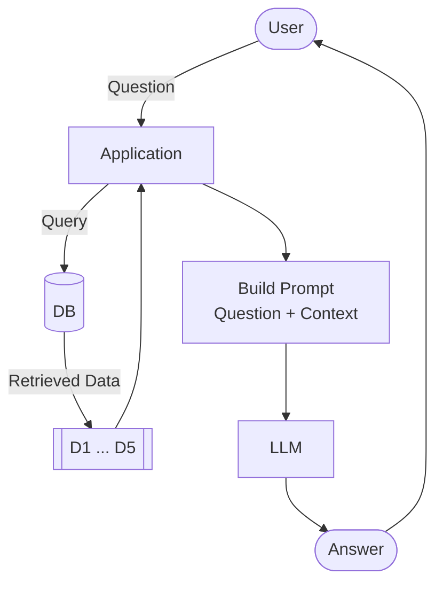

# What is RAG

In our community at DataTalks.Club, we run multiple Zoomcamp courses -
free courses on data engineering, machine learning, MLOps, and other
topics. For each course, we maintain an FAQ document with common
questions and answers.

The problem: some of these documents have over 300 questions. Students
ask us things in Slack like "Can I still join after the course started?"
or "How do I get a certificate?" - and the answers are in the FAQ, but
finding them is tedious.

What we want: a bot that takes all this knowledge and answers student
questions in natural language.

In this module, we'll build that system. But first, let's see why we
can't just use an LLM directly.


## The problem with LLMs

First, let's define a function to talk to the LLM:

```python
def llm(prompt):
    response = openai_client.responses.create(
        model='gpt-5.4-mini',
        input=prompt
    )
    return response.output_text
```

This is our black box - text goes in, text comes out. Let's test it:

```python
llm("Hey, what's up?")
```

It replies with something. The LLM works. Now let's ask it a
course-specific question:

```python
question = 'I just discovered the course. Can I join now?'
answer = llm(question)
print(answer)
```

The LLM gives a generic answer - something like "if enrollment is still
open, you can usually join" or "check the course website." It doesn't
know about our specific Zoomcamp courses, their enrollment policies, or
their schedules. It tries to be helpful, but it has no idea if
enrollment is still open, what the policies are, and so on.

This is different from a question like "how do I cook salmon?" - the
LLM knows the answer because cooking salmon is common knowledge. But
our courses are not in the training data.


## Adding context manually

What if we gave the LLM more context? We have a FAQ website with
questions and answers about our courses. Let's copy some of that
content and put it into context:

```python
context = '''
I just discovered the course. Can I still join?
Yes, but if you want to receive a certificate, you need to submit your project while we're still accepting submissions.

Course: I have registered for the LLM Zoomcamp. When can I expect to receive the confirmation email?
You don't need it. You're accepted. You can also just start learning and submitting homework (while the form is open) without registering. It is not checked against any registered list. Registration is just to gauge interest before the start date.

What is the video/zoom link to the stream for the "Office Hours" or live/workshop sessions?
The zoom link is only published to instructors/presenters/TAs. Students participate via YouTube Live and submit questions to Slido.

Cloud alternatives with GPU
Check the quota and reset cycle carefully. Potential options include Google Colab, Kaggle, Databricks.
'''
```

Now let's build a prompt that includes both the question and the
context:

```python
prompt = f'''
Your task is to answer questions from the course participants
based on the provided context.

Use the context to find relevant information and provide accurate
answers. If the answer is not found in the context,
respond with "I don't know."

Question:
{question}

Context:
{context}
'''
```

Instead of sending the raw question to the LLM, we send this prompt:

```python
answer = llm(prompt)
print(answer)
```

Now the answer is correct: "Yes, you can still join. If you want to
receive a certificate, you need to submit your project while
submissions are still open."

This is the answer we actually want to give to our students. What we
just did is nothing but RAG.


## The RAG idea

RAG stands for Retrieval-Augmented Generation. There are two key words
here: generation and retrieval. Generation is the LLM - it generates
text. Retrieval is search. We use search to augment the LLM's
generation.

In other words: we retrieve relevant documents from our knowledge base,
and use them to augment what the LLM generates.

The reason we use search (retrieval) is to give the LLM more
information, more context, so it can give the right answer.

Right now we used a naive way of selecting context - we knew in advance
which FAQ entry contained the answer. But what we really want is to
perform search automatically - find the most relevant documents and send
those to the LLM.

In code, it looks like this:

```python
def rag(question):
    search_results = search(question)
    user_prompt = build_prompt(question, search_results)
    return llm(user_prompt)
```

That's the entire architecture. Three components:

- search
- prompt
- LLM





The LLM only sees the documents we hand it. So its answers are
grounded in our data. If the right document is retrieved, the answer
is good. If it's not, the answer suffers. Search quality is the
backbone of RAG.

The database and the LLM can be anything. In this course we'll
use minsearch and then sqlitesearch for search, and OpenAI for the
LLM. But you can swap any component and see what works better. That's
what makes RAG so flexible - plug and play.

In the next section, we'll look at the dataset we'll use for our FAQ
knowledge base.

[← Environment](02-environment.md) | [The Course FAQ Dataset →](04-dataset.md)
