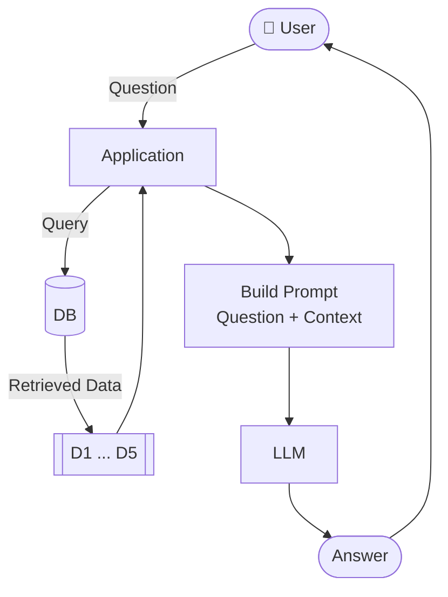

# What is RAG

## The problem with LLMs

Let's try asking an LLM a course-specific question without any
context:

```python
from openai import OpenAI

openai_client = OpenAI()

def ask(prompt):
    response = openai_client.responses.create(
        model="gpt-5.4-mini",
        input=prompt
    )
    return response.output_text
```

```python
ask("Can I still join the course after it started?")
```

The LLM will give a generic answer - something like "it depends on
the course" or "check the course website". It doesn't know about our
specific Zoomcamp courses, their enrollment policies, or their
schedules. It says "I can help you, but I need to know more details."

This is different from a question like "how do I cook salmon?" - the
LLM knows the answer because cooking salmon is common knowledge. But
our courses are not in the training data.

```python
ask("How do I get a certificate?")
```

Same problem. The LLM doesn't know the specific requirements for our
certificates - that you need to submit a capstone project and
peer-review three other projects.

The issue: the LLM's training data doesn't contain our FAQ. It has
general knowledge about courses and certificates, but not the
specific answers to these specific questions.


## The RAG idea

RAG stands for Retrieval-Augmented Generation. There are two key
words here: generation and retrieval. Generation is the LLM - it
generates text. Retrieval is search. We use search to augment the
LLM's generation.

In other words: we retrieve relevant documents from our knowledge
base, and use them to augment what the LLM generates.

The reason we use search (retrieval) is to give the LLM more
information, more context, so it can give the right answer.

In code, it looks like this:

```python
def rag(question):
    search_results = search(question)
    user_prompt = build_prompt(question, search_results)
    return llm(user_prompt)
```

That's the entire architecture. Three components:

- search
- prompt
- LLM





The LLM only sees the documents we hand it. So its answers are
grounded in our data. If the right document is retrieved, the answer
is good. If it's not, the answer suffers. Search quality is the
backbone of RAG.

The database and the LLM can be anything. In this workshop we'll
use minsearch and then sqlitesearch for search, and OpenAI for the
LLM. But you can swap any component and see what works better. That's
what makes RAG so flexible - plug and play.


## RAG vs fine-tuning

A common question: why not fine-tune the model on our data instead?

Fine-tuning means taking a pre-trained model and continuing the
training on your own data. You show it examples of how you want it
to respond, and it adjusts its internal parameters. This is not the
same as training from scratch - you start from an existing model and
adapt it.

Fine-tuning costs money: you need GPUs, time, and hundreds or
thousands of examples. And it changes the model's behavior (how it
responds, what style it uses), but it's not great for injecting
knowledge. You'd need to retrain every time your data changes.

RAG keeps the model frozen and brings fresh data to it at query time.
It's simpler, cheaper, and always up-to-date. You don't need any
training data - just your documents and a search index.

In practice, they complement each other - fine-tune for style, RAG
for knowledge.

[← The Use Case: Course FAQ](03-use-case.md) | [Search →](05-search.md)
