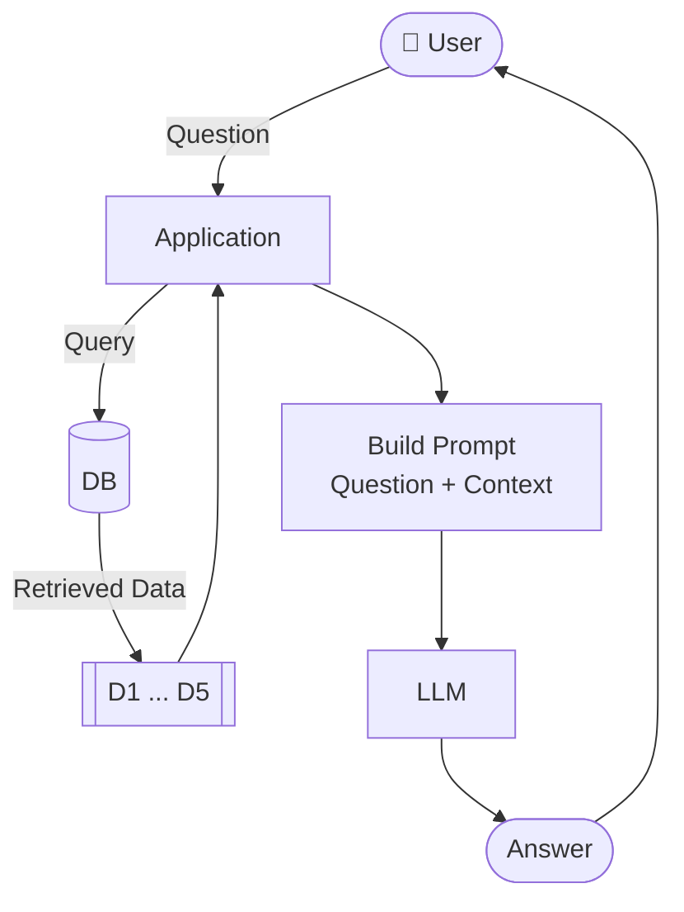

# The LLM

The last component of our RAG pipeline is the LLM itself. It takes
the prompt we built and generates an answer.


## Making a request

We already briefly saw how to make requests to OpenAI: 

```python
response = openai_client.responses.create(
    model="gpt-5.4-mini",
    input="What is 2 + 2?"
)

response
```

The response is a Pydantic object. We can turn it into readable JSON:

```python
print(response.model_dump_json(indent=2))
```

Take a moment to look at the fields. You'll see the answer text, the
model used, usage info, and other metadata.


## Exploring the response

The answer is in `response.output` - a list of output items. The
first one is the message:

```python
response.output[0]
```

The message has a `content` list, and the text is in the first item:

```python
response.output[0].content[0].text
```

That's a lot of digging. There's a shortcut:

```python
response.output_text
```

Same result, less code.

The usage counts tell you how many tokens the request consumed:

```python
response.usage
```

You'll see something like:

```
ResponseUsage(input_tokens=14, output_tokens=6, total_tokens=20)
```


## Calculating the price

You can use different models. In this course we'll use
[gpt-5.4-mini](https://developers.openai.com/api/docs/models/gpt-5.4-mini):

- Input: $0.75 per million tokens
- Output: $4.50 per million tokens

If you want something cheaper, [gpt-4o-mini](https://developers.openai.com/api/docs/models/gpt-4o-mini) also works well:

- Input: $0.15 per million tokens
- Output: $0.60 per million tokens

Let's calculate the cost of the request we just made:

```python
input_price = 0.75 / 1_000_000
output_price = 4.50 / 1_000_000

cost = (
    response.usage.input_tokens * input_price +
    response.usage.output_tokens * output_price
)

cost
```

This particular request costs a fraction of a cent. Even a full RAG
query with a long prompt stays under $0.01.


## The LLM function

Now let's wrap it in a function. We'll use this in our RAG pipeline:

```python
def llm(instructions, user_prompt, model="gpt-5.4-mini"):
    input_messages = [
        {"role": "developer", "content": instructions},
        {"role": "user", "content": user_prompt}
    ]

    response = openai_client.responses.create(
        model=model,
        input=input_messages
    )

    return response.output_text
```

Test it:

```python
instructions = "You're a course teaching assistant."
user_prompt = "What is 2 + 2?"

llm(instructions, user_prompt)
```

For other LLM providers, the API may be different - check their docs.


## Full RAG

Now we have all three components: search, prompt, and LLM. Let's wire
them together.

```python
def rag(query, model="gpt-5.4-mini"):
    search_results = search(query)
    prompt = build_prompt(query, search_results)
    answer = llm(INSTRUCTIONS, prompt, model=model)
    return answer
```

Let's revise the flow:



Try it:

```python
query = "How do I run Docker on Windows?"
answer = rag(query)
print(answer)
```

The answer should be based on the FAQ documents - not on the LLM's
general knowledge. The LLM read the search results and generated a
response grounded in our data.


## Try more questions

```python
rag("Can I still join the course after it started?")
```

```python
rag("How do I get a certificate?")
```

```python
rag("What's the best way to store API keys?")
```

Notice how the answers reference specific courses and sections.
That's RAG in action - the LLM is reading from our knowledge base.

This approach is modular. Each component is independent and
replaceable: you can swap the search backend, the prompt template,
or the LLM model without touching the rest. Later when we replace
minsearch with sqlitesearch, only the `search` function changes.

[← Building the Prompt](06-building-prompt.md) | [Data Ingestion →](08-data-ingestion.md)
