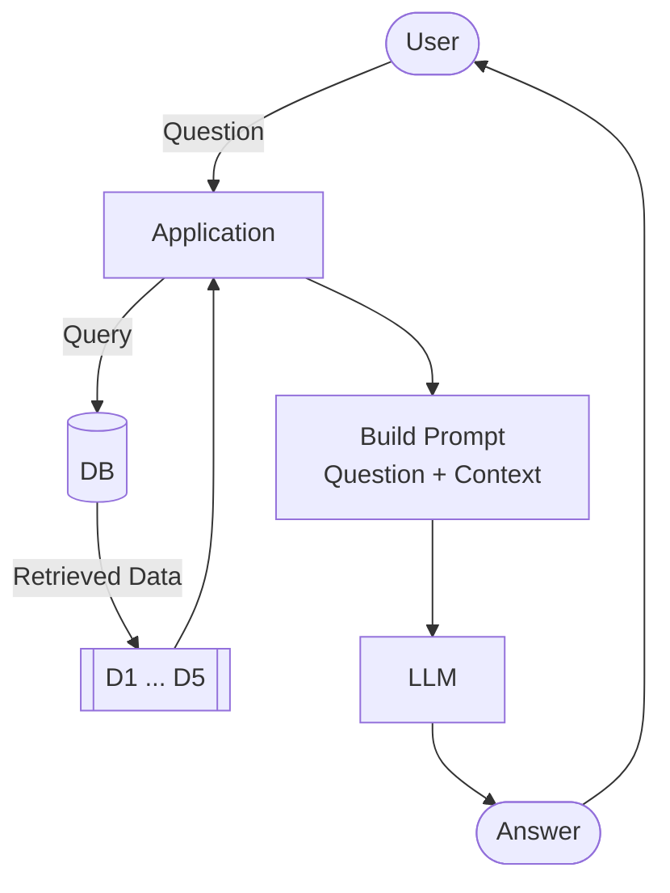

# The LLM

The last component of our RAG pipeline is the LLM itself. It takes
the prompt we built and generates an answer.


## Sending the prompt to the LLM

Now we have the prompt from the previous section. Let's send it to the
LLM:

```python
response = openai_client.responses.create(
    model='gpt-5.4-mini',
    input=prompt
)
```

We use OpenAI's Responses API (`openai_client.responses.create`). OpenAI
has two APIs: chat completions and responses. Chat completions is the
older one - it's now considered legacy. When the first edition of this
course started, the Responses API didn't exist, so we used chat
completions. Now we prefer responses - it's more convenient.

Many other LLM providers (Groq, Gemini, etc.) support the chat
completions API, so you can use the OpenAI client with them too. You
would just need to use `chat.completions` instead of `responses`.


## Exploring the response

The response is a Pydantic object. The answer is in `response.output` -
a list of output items. The first one is the message:

```python
response.output[0]
```

The message has a `content` list, and the text is in the first item:

```python
response.output[0].content[0].text
```

That's a lot of digging. There's a shortcut:

```python
response.output_text
```

Same result, less code. The answer should be something like: "Yes, you
can still join. If you want to receive a certificate, make sure to
submit your project while submissions are still open."

The usage counts tell you how many tokens the request consumed:

```python
response.usage
```

You'll see something like:

```
ResponseUsage(input_tokens=334, output_tokens=39, total_tokens=373)
```


## Calculating the price

You can use different models. In this course we'll use
[gpt-5.4-mini](https://developers.openai.com/api/docs/models/gpt-5.4-mini):

- Input: $0.75 per million tokens
- Output: $4.50 per million tokens

Let's calculate the cost of the request we just made:

```python
input_price = 0.75 / 1_000_000
output_price = 4.50 / 1_000_000

cost = (
    response.usage.input_tokens * input_price +
    response.usage.output_tokens * output_price
)

cost
```

This particular request costs a fraction of a cent. Even a full RAG
query with a long prompt stays under $0.01. We really need to send a
lot of queries to even spend one cent.


## Message history

Previously we sent only one string as input and got back a response.
In practice, you typically send a message history - a list of messages
where each message has a role.

Think of ChatGPT: there's a system prompt (hidden, tells it how to
behave), then your message, then the reply, then your next message,
and so on. The LLM needs the full conversation history to continue
the conversation.

In our case, we send two messages:

- `developer` - system-level instructions (how the LLM should behave)
- `user` - the actual prompt with the question and context

```python
message_history = [
    {'role': 'developer', 'content': INSTRUCTIONS},
    {'role': 'user', 'content': prompt}
]

response = openai_client.responses.create(
    model='gpt-5.4-mini',
    input=message_history
)
```

This separates what the LLM should always do (the instructions, same
every time) from what the user asks (varies from request to request).

Why `developer` and not `system`? Both work. You can use either one -
there is some difference between them, but in practice the result is
the same. We use `developer` in this course.


## The LLM function

We can now put this together into an updated `llm` function. It now
takes both instructions and the user prompt:

```python
def llm(instructions, user_prompt, model='gpt-5.4-mini'):
    message_history = [
        {'role': 'developer', 'content': instructions},
        {'role': 'user', 'content': user_prompt}
    ]

    response = openai_client.responses.create(
        model=model,
        input=message_history
    )

    return response.output_text
```


## Full RAG

Now we have all three components: search, prompt, and LLM. Let's wire
them together:

```python
def rag(query, model='gpt-5.4-mini'):
    search_results = search(query)
    prompt = build_prompt(query, search_results)
    answer = llm(INSTRUCTIONS, prompt, model=model)
    return answer
```

Let's revise the flow:



Try it:

```python
answer = rag('I just discovered the course. Can I join now?')
print(answer)
```

The answer should be based on the FAQ documents - not on the LLM's
general knowledge. The LLM read the search results and generated a
response grounded in our data.


## Try more questions

```python
rag('How do I get a certificate?')
```

Notice how the answers reference specific courses and sections.
That's RAG in action - the LLM is reading from our knowledge base.

This approach is modular. Each component is independent and
replaceable: you can swap the search backend, the prompt template,
or the LLM model without touching the rest. Later when we replace
minsearch with sqlitesearch, only the `search` function changes.

Code: [notebook.ipynb](../code/notebook.ipynb)

[← Building the Prompt](06-building-prompt.md) | [RAG Helper →](08-rag-helper.md)
