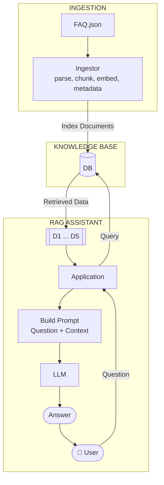

# Data Ingestion

So far, our RAG pipeline loads data and builds the search index at
startup. With minsearch, this is fine - our FAQ dataset is small, so
indexing takes less than a second. The entire pipeline runs in one
process.

But what happens when the dataset grows? If you have millions of
documents, or if fetching the data takes time (calling APIs, parsing
files, cleaning text), the startup becomes slow. You don't want to
wait minutes every time your service restarts.

The problem with minsearch is that it's in-memory. It's just a bunch
of Python dictionaries - it's bound to the process where it's running.
When you stop the process, the data disappears. You need to re-index
every time you restart.

The solution: separate ingestion from querying. One process writes
the data to a persistent search index. Another process reads from it.
The index survives restarts, so you only ingest once.

You can use any persistent search backend for this - Elasticsearch,
OpenSearch, Qdrant, and so on. In this module, we'll use
[sqlitesearch](https://github.com/alexeygrigorev/sqlitesearch) - a
lightweight search library backed by SQLite FTS5. It has the same API
as minsearch, so switching is straightforward - it's a drop-in
replacement, but persistent.

SQLite comes with Python - you don't need any extra dependencies. And
SQLite has FTS5 (full text search) built in. So if you have Python,
you already have access to a full text search engine. sqlitesearch is
just a convenient wrapper around it.

You can read more about the history of this library [here](https://alexeyondata.substack.com/p/how-i-built-sqlitesearch-a-lightweight).

Install it:

```bash
uv add sqlitesearch
```


## Ingestion notebook

Create a new notebook called `sqlite-ingest.ipynb` (see [persistent_rag_ingest.ipynb](../code/persistent_rag_ingest.ipynb) for reference). This is the
ingestion process - it fetches data and writes it to a persistent
index.

First, load the data using the function from `ingest.py`:

```python
from ingest import load_faq_data

documents = load_faq_data()
print(f'Loaded {len(documents)} documents')
```

Filter to just the LLM Zoomcamp documents:

```python
docs_llm = [doc for doc in documents if doc['course'] == 'llm-zoomcamp']
print(f'LLM Zoomcamp: {len(docs_llm)} documents')
```


Now create a sqlitesearch index and add documents one by one with a
small delay (to simulate slow ingestion):

```python
import time
from sqlitesearch import TextSearchIndex

index = TextSearchIndex(
    text_fields=['question', 'section', 'answer'],
    keyword_fields=['course'],
    db_path='faq.db'
)

for doc in docs_llm:
    index.add(doc)
    print(f'Added: {doc["question"][:60]}...')
    time.sleep(0.5)

index.close()
print('Done. Index saved to faq.db')
```

Run this notebook. You'll see each document being added one by one.
When it's done, there's a `faq.db` file on disk with the entire index.
This file persists across restarts.


## Querying notebook

While the ingestion is running (or after it finishes), create another
notebook (see [persinsent_rag.ipynb](../code/persinsent_rag.ipynb) for reference). Connect to the same database:

```python
from sqlitesearch import TextSearchIndex

sqlite_index = TextSearchIndex(
    text_fields=['question', 'section', 'answer'],
    keyword_fields=['course'],
    db_path='faq.db'
)
```

Check how many documents are in the index:

```python
sqlite_index.count()
```

Run this cell a few times while the other notebook is still ingesting -
you'll see the number growing as ingestion progresses. This is normal
database behavior: one process writes, another reads. With minsearch,
this is impossible because the index lives in one process's memory.

Try a search:

```python
results = sqlite_index.search('Can I still join the course after it started?', num_results=5)
[doc['question'] for doc in results]
```


## RAG with sqlitesearch

Now let's use the `RAGBase` class from `rag_helper.py` with this
sqlitesearch index. Because our RAG is modular, we just swap the
search index - the rest of the code stays the same:

```python
from rag_helper import RAGBase
from openai import OpenAI

openai_client = OpenAI()

assistant = RAGBase(
    index=sqlite_index,
    llm_client=openai_client,
)
```

Notice: no `fit` call, no data loading. The index is already populated
by the ingestion notebook. We just connect to the database file.

Try it:

```python
answer = assistant.rag('Can I still join the course after it started?')
print(answer)
```

The answer should be similar to what we got with minsearch. But now the
data comes from a persistent index - no fetching, no processing, no
indexing at startup. And we didn't have to rewrite any of the RAG
logic - just swapped the index.

This is the power of the modular design: `ingest.py` handles data
loading and indexing, `rag_helper.py` handles the RAG pipeline, and
the notebooks just wire them together.

This works because sqlitesearch follows the same API as minsearch -
both have a `search` method that takes a query, `boost_dict`,
`filter_dict`, and `num_results`. If the API were different, we'd
need to subclass `RAGBase` and override the `search` method to adapt
to the new backend.


## Comparing the two approaches

With minsearch (single process):

```
Startup: fetch data -> parse -> index -> ready
Every restart: repeat all steps
```

With sqlitesearch (two processes):

```
Ingestion (runs once): fetch data -> parse -> write to faq.db
Query (runs every time): open faq.db -> search -> ready
```



For our FAQ dataset, both produce good results. The difference
matters more at scale with diverse document lengths.


## When to use what

| | minsearch | sqlitesearch |
|---|---|---|
| Architecture | Single process | Ingestion + query |
| Persistence | In-memory only | File-based (SQLite) |
| Startup time | Index every time | Open existing index |
| Scale | Thousands of docs | Millions of docs |
| When to use | Small data, fast startup | Large data, slow ingestion |

The principle: use minsearch when you can load and index the data on
startup without noticeable delay. Switch to a persistent backend when
ingestion takes too long or when you need the index to survive
restarts.

For larger production systems, you'd use the same pattern but with
Elasticsearch, OpenSearch, or a vector database like Qdrant or
Weaviate instead of sqlitesearch. The architecture stays the same:
one process ingests, another queries.


## Cleaning up

When you're done, close the database connection:

```python
sqlite_index.close()
```

Or just let Python clean it up when the notebook kernel shuts down.

Code: [persistent_rag_ingest.ipynb](../code/persistent_rag_ingest.ipynb) | [persinsent_rag.ipynb](../code/persinsent_rag.ipynb)

[← RAG Helper](08-rag-helper.md) | [Next Steps →](10-next-steps.md)
