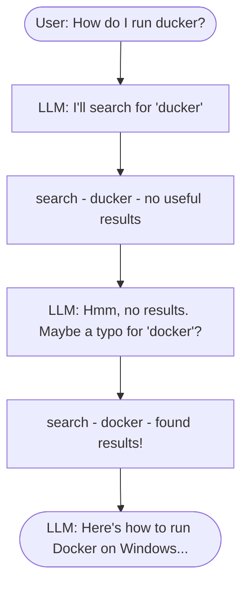
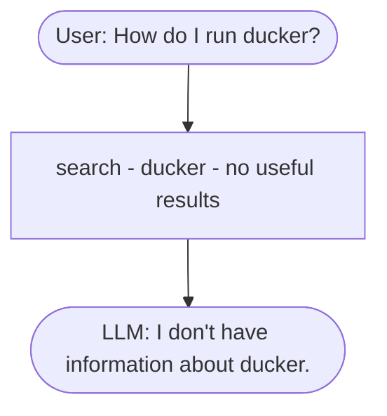

# Agents

In our RAG pipeline, the flow is fixed: search, build prompt, LLM. The
LLM never decides to search. It just receives the search results and
answers. It's a passenger, not a driver.

An agent is different. With an agent, the LLM decides when to search,
what to search for, and whether to search again. The LLM is in control.

The key difference is about who makes the decisions:

- RAG: the developer decides. The pipeline is fixed. Search always
  runs once, with the exact user query.
- Agent: the LLM decides. It chooses which actions to take and when to
  stop.

## The agentic workflow

We give the LLM a list of tools: functions it can call. For example,
we might give it a `search` tool that queries our FAQ database.

Then the conversation goes like this:

1. The user asks a question.
2. The LLM decides if it needs to use a tool.
3. If yes, it outputs a function call (for example, "search for
   docker").
4. Our code executes the function and gives the result back to the LLM.
5. The LLM can call another tool, or produce the final answer.

The LLM doesn't execute the function. It tells us what to call,
and our code executes it. This is important for safety: the LLM can't
do anything we don't allow.

This is sometimes called "agentic RAG" or "tool use" or "function
calling". Different names, same idea: the LLM decides which tools to
use.

## The typo example

Remember the "ducker" example from the last lesson? Here's how an agent
would handle it:

The LLM searched, saw the results were bad, and decided to try again
with a different query. It made this decision on its own. We didn't
write code to handle typos. The LLM figured it out.

Compare this with the RAG pipeline:

The pipeline searches once and stops. The LLM can't ask for better
results because it doesn't have that ability. It just gets whatever the
search returns and does its best.

The agent is more flexible. It can adapt, retry, and recover from
failures. But this flexibility comes at a cost: each tool call is an
API request, which means more latency and more tokens. In the next
lessons, we'll see how to implement this in code.

[← Quick RAG Revision](02-rag-revision.md) | [Function Calling →](04-function-calling.md)
