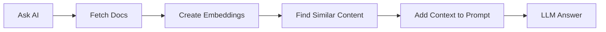

# Retrieval Augmented Generation

AI Copilot solves the context problem for flow generation. But what about workflows that need to answer questions from your own data? That's where RAG comes in.

## What is RAG?

**RAG (Retrieval Augmented Generation)** is a technique that retrieves relevant information from your data sources, augments the AI prompt with that context, and generates a response grounded in real data. This solves the hallucination problem by ensuring the AI has access to current, accurate information at query time.

For a deeper dive into RAG and vector search, see [Module 2](../../02-vector-search/lessons/06-rag-vector.md).

## How RAG Works in Kestra



The process:

1. **Ingest documents**: Load documentation, release notes, or other data sources
2. **Create embeddings**: Convert text into vector representations using an LLM
3. **Store embeddings**: Save vectors in Kestra's KV Store (or a vector database)
4. **Query with context**: When you ask a question, retrieve relevant embeddings and include them in the prompt
5. **Generate response**: The LLM has real context and provides accurate answers

## Example: Kestra Release Features

### Step 1: Without RAG

Flow: [`1_chat_without_rag.yaml`](../flows/1_chat_without_rag.yaml)

This flow asks Gemini: **"Which features were released in Kestra 1.1?"**

Without RAG, the model might hallucinate features that don't exist, provide outdated information, or give vague generic answers.

Import and run this flow, then check the output — the response won't be accurate.

### Step 2: With RAG

Flow: [`2_chat_with_rag.yaml`](../flows/2_chat_with_rag.yaml)

This flow:

1. **Ingests** the Kestra 1.1 release blog post from GitHub
2. **Creates embeddings** using Gemini's embedding model
3. **Stores** embeddings in Kestra's KV Store
4. **Asks the LLM** the same question with RAG enabled
5. **Returns** an accurate response with real features from that release

Import and run `2_chat_with_rag.yaml` and compare the output quality against the previous flow.

## Extending RAG with web search

The examples above use static RAG — documents are ingested once and stored in the KV Store. Kestra also supports **web search as a retriever**, which fetches live results at query time and passes them as context to the LLM:

```yaml
id: rag_with_websearch_content_retriever
namespace: company.ai

tasks:
  - id: chat_with_rag_and_websearch_content_retriever
    type: io.kestra.plugin.ai.rag.ChatCompletion
    chatProvider:
      type: io.kestra.plugin.ai.provider.GoogleGemini
      modelName: gemini-2.5-flash
      apiKey: "{{ secret('GEMINI_API_KEY') }}"
    contentRetrievers:
      - type: io.kestra.plugin.ai.retriever.TavilyWebSearch
        apiKey: "{{ secret('TAVILY_API_KEY') }}"
    systemMessage: You are a helpful assistant that can answer questions about Kestra.
    prompt: What is the latest release of Kestra?
```

The `TavilyWebSearch` retriever queries [Tavily](https://www.tavily.com/) and injects the results as context before the LLM generates a response — no ingestion step required.

### Static RAG vs. web search RAG

| | Static RAG | Web Search RAG |
|---|---|---|
| **Data source** | Documents you ingested | Live web results |
| **Best for** | Internal docs, policies, fixed knowledge bases | Time-sensitive or frequently changing information |
| **Ingestion step** | Required | Not required |
| **Example question** | "What does our refund policy say?" | "What is the latest release of Kestra?" |

Use static RAG when you control the source material. Use web search RAG when the answer depends on information that changes faster than you can re-ingest.

## Best Practices

1. **Keep documents updated**: Re-ingest regularly so your KV Store reflects current information
2. **Chunk appropriately**: Break large documents into meaningful sections before ingesting
3. **Test retrieval quality**: Verify the right documents are being retrieved for your queries
4. **Choose the right retriever**: Static RAG for controlled knowledge bases, web search for live data

[← AI Copilot](04-ai-copilot.md) | [AI Agents →](06-agents.md)
