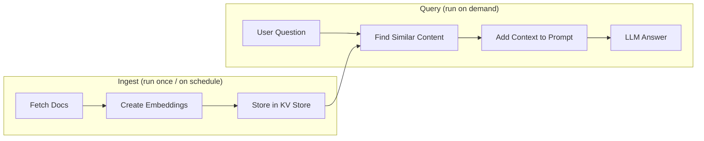

# Retrieval Augmented Generation

Video: [RAG Workflows](https://youtu.be/FhGZV173xrk)

AI Copilot solves the context problem for flow generation. But what about workflows that need to answer questions from your own data? That's where RAG comes in.

> Note: Flows 1 and 2 use `{{ secret('GEMINI_API_KEY') }}`. Flow 3 uses `{{ secret('OPENAI_API_KEY') }}` and `{{ secret('TAVILY_API_KEY') }}`. Make sure you've completed the [setup instructions](03-setup.md) to configure the relevant secrets before running them.

## What is RAG?

RAG (Retrieval Augmented Generation) is a technique that retrieves relevant information from your data sources, augments the AI prompt with that context, and generates a response grounded in real data. This solves the hallucination problem by ensuring the AI has access to current, accurate information at query time.

For a deeper dive into RAG concepts, see [Module 1: Intro to RAG](../../01-agentic-rag/lessons/03-rag.md). For vector search, see [Module 2: Vector Search](../../02-vector-search/lessons/04-vector-search.md).

## How RAG Works in Kestra

RAG has two phases. In the demo flows below they run back-to-back, but in production you'd typically schedule them separately — ingest on a cadence, query on demand.



Ingest phase (run once, or on a schedule when your data changes):

1. Fetch documents: load documentation, release notes, or other data sources
2. Create embeddings: convert text into vectors using an embedding model
3. Store embeddings: save vectors in Kestra's KV Store

> Note: The flows store embeddings in Kestra's KV Store for simplicity. This is convenient for learning and small-scale demos, but it is not a replacement for a proper vector database. For any serious workload, e.g. larger document sets, low-latency retrieval, or production use, you should use a dedicated vector store. See [Module 2: Vector Search](../../02-vector-search/lessons/04-vector-search.md) for a deeper look at vector search in practice.

Query phase (runs every time a question is asked):

4. Retrieve context: find the embeddings most similar to the user's question
5. Augment the prompt: add the retrieved content to the LLM prompt
6. Generate response: the LLM answers using real, grounded context

## Example: Kestra Release Features

### Step 1: Without RAG

Flow: [`1_chat_without_rag.yaml`](../flows/1_chat_without_rag.yaml)

This flow asks Gemini: "Which features were released in Kestra 1.1?"

Without RAG, the model might hallucinate features that don't exist, provide outdated information, or give vague generic answers.

Import and run this flow, then check the output — the response won't be accurate.

### Step 2: With RAG

Flow: [`2_chat_with_rag.yaml`](../flows/2_chat_with_rag.yaml)

This flow:

1. Ingests the Kestra 1.1 release blog post from GitHub
2. Creates embeddings using Gemini's embedding model
3. Stores embeddings in Kestra's KV Store
4. Asks the LLM the same question with RAG enabled
5. Returns an accurate response with real features from that release

Import and run `2_chat_with_rag.yaml` and compare the output quality against the previous flow.

## Extending RAG with web search

The examples above use static RAG — documents are ingested once and stored in the KV Store. Kestra also supports web search as a retriever, which fetches live results at query time and passes them as context to the LLM.

Flow: [`3_rag_with_websearch.yaml`](../flows/3_rag_with_websearch.yaml)

> Note: This flow uses OpenAI as its AI provider. To run it, you'll need an OpenAI API key:
>
> 1. Visit [platform.openai.com](https://platform.openai.com/home) and sign in or create an account
> 2. Go to API keys and create a new key
> 3. Export it as a secret before starting Kestra:
>    ```bash
>    export SECRET_OPENAI_API_KEY=$(echo -n "your-openai-api-key-here" | base64)
>    docker compose up -d
>    ```
> 4. Reference it in flows with `{{ secret('OPENAI_API_KEY') }}`
>
> If you'd prefer to keep using Gemini, swap the `provider` block for `io.kestra.plugin.ai.provider.GoogleGemini` with your Gemini API key. See the [full list of supported providers](https://kestra.io/plugins/plugin-ai/provider).

The `TavilyWebSearch` retriever queries [Tavily](https://www.tavily.com/) and injects the results as context before the LLM generates a response — no ingestion step required. However, the results are only as good as the search engine, and may not be relevant or accurate. Always test the quality of retrieved context when using web search RAG.

### Static RAG vs. web search RAG

| | Static RAG | Web Search RAG |
|---|---|---|
| Data source | Documents you ingested | Live web results |
| Best for | Internal docs, policies, fixed knowledge bases | Time-sensitive or frequently changing information |
| Ingestion step | Required | Not required |
| Example question | "What does our refund policy say?" | "What is the latest release of Kestra?" |

Use static RAG when you control the source material. Use web search RAG when the answer depends on information that changes faster than you can re-ingest.

## Best Practices

1. Keep documents updated: re-ingest regularly so your KV Store reflects current information
2. Chunk appropriately: break large documents into meaningful sections before ingesting
3. Test retrieval quality: verify the right documents are being retrieved for your queries
4. Choose the right retriever: static RAG for controlled knowledge bases, web search for live data

[← AI Copilot](04-ai-copilot.md) | [AI Agents →](06-agents.md)
