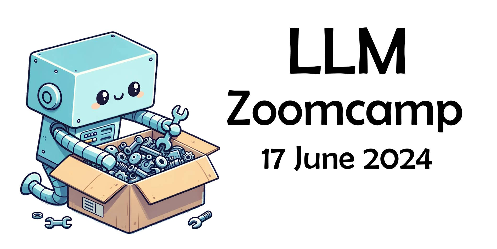

# LLM Zoomcamp 

  

LLM Zoomcamp - a free online course about real-life applications of LLMs. In 10 weeks you will learn how to build an AI system that answers questions about your 
knowledge base.

  

- Give us a star to support the course!
- Register in [DataTalks.Club's Slack](https://datatalks.club/slack.html)
- Join the [`#course-llm-zoomcamp`](https://app.slack.com/client/T01ATQK62F8/C06TEGTGM3J) channel
- Join the [course Telegram channel with announcements](https://t.me/llm_zoomcamp)
- The videos are published on [DataTalks.Club's YouTube channel](https://www.youtube.com/c/DataTalksClub) in [the course playlist](https://www.youtube.com/playlist?list=PL3MmuxUbc_hKiIVNf7DeEt_tGjypOYtKV)
- [Frequently asked technical questions](https://docs.google.com/document/d/1m2KexowAXTmexfC5rVTCSnaShvdUQ8Ag2IEiwBDHxN0/edit?usp=sharing)
- [Course Calendar](https://calendar.google.com/calendar/?cid=NjkxOThkOGFhZmUyZmQwMzZjNDFkNmE2ZDIyNjE5YjdiMmQyZDVjZTYzOGMxMzQyZmNkYjE5Y2VkNDYxOTUxY0Bncm91cC5jYWxlbmRhci5nb29nbGUuY29t)

## 2024 cohort 

- Start date: June 17
- [Materials specific to 2024 cohort](cohorts/2024/)
 

## Pre-requisites

* Comfortable with programming and Python
* Comfortable with command line
* Docker
* No previous exposure to AI or ML is required

## Syllabus

We encourage [Learning in Public](learning-in-public.md)

### Pre-course workshops

Implement a search engine: [Video](https://www.youtube.com/watch?v=nMrGK5QgPVE), [code](https://github.com/alexeygrigorev/build-your-own-search-engine)

### [Introduction to LLMs and RAG](01-intro/)

* LLMs and RAG
* Preparing the environment 
* Retrieval and the basics of search
* OpenAI API
* Simple RAG with Open AI
* Text search with Elasticsearch

### [Open-source LLMs](02-open-source/)

* Getting an environment with a GPU
* Open-source models from HuggingFace Hub
* Running LLMs on a CPU with Ollama
* Creating a simple UI with Streamlit 

### [Vector databases](03-vector-search/)

* Vector search
* Creating and indexing embeddings
* Vector search with Elasticsearch

### [Workshop: dlt](cohorts/2024/workshops/dlt.md)

### [Monitoring](04-monitoring/)

* Computing metrics to monitor the quality of LLM answers
* Tracking chat history and user feedback
* Creating dashboards with Grafana for visualization

### [LLM orchestration and ingestion](05-orchestration/)

* Ingesting data with Mage

### [Best practices](06-best-practices/)

* Best practices

### LLM Zoomcamp 2024 Competition

[More details](cohorts/2024/competition/)

### [Hands-on project](project.md)

  

## Instructors

- [Alexey Grigorev](https://linkedin.com/in/agrigorev/)
- [Magdalena Kuhn](https://www.linkedin.com/in/magdalenakuhn/)
- [Balaji Dhamodharan](https://www.linkedin.com/in/balaji-dhamodharan-91b45615/)

## Asking questions

The best way to get support is to use [DataTalks.Club's Slack](https://datatalks.club/slack.html). Join the [`#course-llm-zoomcamp`](https://app.slack.com/client/T01ATQK62F8/C06TEGTGM3J).

To make discussions in Slack more organized:

* Follow [these recommendations](asking-questions.md) when asking for help
* Read the [DataTalks.Club community guidelines](https://datatalks.club/slack/guidelines.html)

## Supporters and partners

Thanks to the course sponsors for making it possible to run this course

  

  

  

Do you want to support our course and our community? Please reach out to [alexey@datatalks.club](alexey@datatalks.club)
