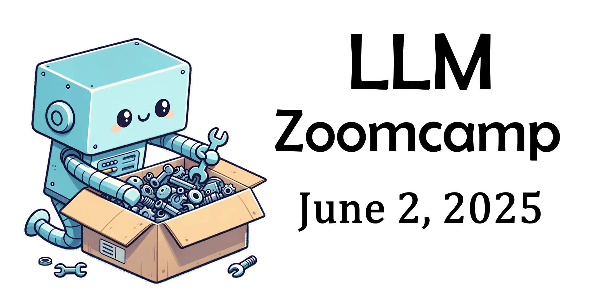
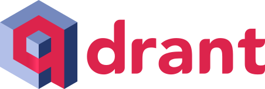

  

<h1 align="center">
    <strong>LLM Zoomcamp: A Free Course on Real-Life Applications of LLMs</strong>
</h1>

In 10 weeks, learn how to build AI systems that answer questions about your knowledge base. Gain hands-on experience with LLMs, RAG, vector search, evaluation, monitoring, and more.

<a href="https://datatalks.club/slack.html">Join Slack</a> •
<a href="https://app.slack.com/client/T01ATQK62F8/C06TEGTGM3J">#course-llm-zoomcamp Channel</a> •
<a href="https://t.me/llm_zoomcamp">Telegram Announcements</a> •
<a href="https://www.youtube.com/playlist?list=PL3MmuxUbc_hIB4fSqLy_0AfTjVLpgjV3R">Course Playlist</a> •
<a href="https://docs.google.com/document/d/1m2KexowAXTmexfC5rVTCSnaShvdUQ8Ag2IEiwBDHxN0/edit?usp=sharing">FAQ</a>

## How to Take LLM Zoomcamp

### 2025 Cohort
- **Start Date**: June 2, 2025, 17:00 CET
- **Register Here**: [Sign up](https://airtable.com/appPPxkgYLH06Mvbw/shr7WtxHEPXxaui0Q)

2025 cohort checklist:
- Subscribe to our [Google Calendar](https://calendar.google.com/calendar/?cid=NjkxOThkOGFhZmUyZmQwMzZjNDFkNmE2ZDIyNjE5YjdiMmQyZDVjZTYzOGMxMzQyZmNkYjE5Y2VkNDYxOTUxY0Bncm91cC5jYWxlbmRhci5nb29nbGUuY29t)
- Check [2025 cohort folder](https://github.com/DataTalksClub/llm-zoomcamp/tree/main/cohorts/2025) to stay updated
- Watch [live Q&A](https://youtube.com/live/8lgiOLMMKcY) about the course
- Watch [live course launch](https://www.youtube.com/live/FgnelhEJFj0) stream
- Save the [2025 course playlist](https://youtube.com/playlist?list=PL3MmuxUbc_hIoBpuc900htYF4uhEAbaT-&si=n7CuD0DEgPtnbtsI) on YouTube
- Check course content by navigating to the right module on GitHub
- Share this course with a friend!

### Self-Paced Learning
You can follow the course at your own pace:
1. Watch the course videos.
2. Complete the homework assignments.
3. Work on a project and share it in Slack for feedback.

## Syllabus

### Pre-course Workshops
- [Build a Search Engine](https://www.youtube.com/watch?v=nMrGK5QgPVE) ([Code](https://github.com/alexeygrigorev/build-your-own-search-engine))

### Modules

#### [Module 1: Introduction to LLMs and RAG](01-intro/)
- Basics of LLMs and Retrieval-Augmented Generation (RAG)
- OpenAI API and text search with Elasticsearch

#### [Module 2: Vector Search](02-vector-search/)

- Vector search and embeddings
- Indexing and retrieving data efficiently
- Using Qdrant as the vestor database

#### [Workshop: Open-Source Data Ingestion](cohorts/2025/workshops/dlt.md)

- Using `dlt` for ingesting data for RAG

#### [Module 3: Evaluation](03-evaluation/)

- Search evaluation
- Online vs offline evaluation
- LLM as a Judge

#### [Module 4: Monitoring](04-monitoring/)

- Online evaluation techniques
- Monitoring user feedback with dashboards

#### [Module 5: Best Practices](05-best-practices/)
- Hybrid search
- Document reranking

#### [Module 6: Bonus - End-to-End Project](06-project-example/)
- Build a fitness assistant using LLMs

### [Capstone Project](project.md)

Put eveything you learned into practice

## Meet the Instructors
- [Alexey Grigorev](https://linkedin.com/in/agrigorev/)
- [Timur Kamaliev](https://www.linkedin.com/in/timurkamaliev/)

## Community & Support

### **Getting Help on Slack**
Join the [`#course-llm-zoomcamp`](https://app.slack.com/client/T01ATQK62F8/C06TEGTGM3J) channel on [DataTalks.Club Slack](https://datatalks.club/slack.html) for discussions, troubleshooting, and networking.

To keep discussions organized:
- Follow [our guidelines](asking-questions.md) when posting questions.
- Review the [community guidelines](https://datatalks.club/slack/guidelines.html).

## Sponsors & Supporters
A special thanks to our course sponsors for making this initiative possible!

  

  

  

Interested in supporting our community? Reach out to [alexey@datatalks.club](mailto:alexey@datatalks.club).

## About DataTalks.Club

  

<a href="https://datatalks.club/">DataTalks.Club</a> is a global online community of data enthusiasts. It's a place to discuss data, learn, share knowledge, ask and answer questions, and support each other.

<a href="https://datatalks.club/">Website</a> •
<a href="https://datatalks.club/slack.html">Join Slack Community</a> •
<a href="https://us19.campaign-archive.com/home/?u=0d7822ab98152f5afc118c176&id=97178021aa">Newsletter</a> •
<a href="http://lu.ma/dtc-events">Upcoming Events</a> •
<a href="https://calendar.google.com/calendar/?cid=ZjhxaWRqbnEwamhzY3A4ODA5azFlZ2hzNjBAZ3JvdXAuY2FsZW5kYXIuZ29vZ2xlLmNvbQ">Google Calendar</a> •
<a href="https://www.youtube.com/@DataTalksClub/featured">YouTube</a> •
<a href="https://github.com/DataTalksClub">GitHub</a> •
<a href="https://www.linkedin.com/company/datatalks-club/">LinkedIn</a> •
<a href="https://twitter.com/DataTalksClub">Twitter</a>

All the activity at DataTalks.Club mainly happens on [Slack](https://datatalks.club/slack.html). We post updates there and discuss different aspects of data, career questions, and more.

At DataTalksClub, we organize online events, community activities, and free courses. You can learn more about what we do at [DataTalksClub Community Navigation](https://www.notion.so/DataTalksClub-Community-Navigation-bf070ad27ba44bf6bbc9222082f0e5a8?pvs=21).
