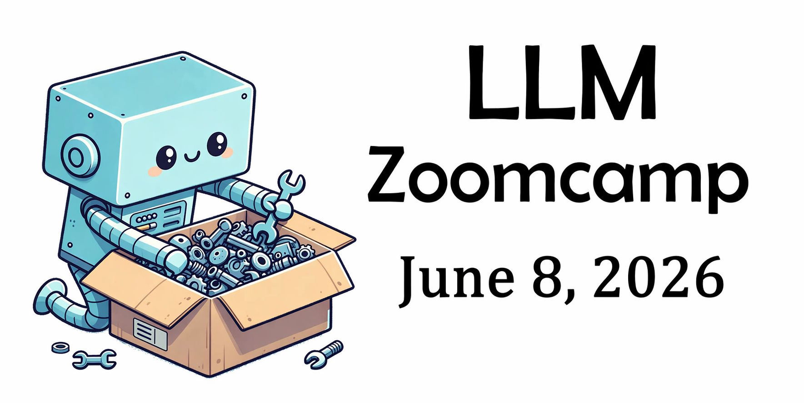

<h1>LLM Zoomcamp: Free Course on Building LLM Applications with RAG, Agents & Vector Search</h1>
<h3>Go from LLM basics to a production-ready AI assistant in 10 weeks</h3>

Learn Retrieval-Augmented Generation, vector search, embeddings, AI agents, function calling, evaluation, monitoring, hybrid search, reranking, and more - all in a free, open-source, hands-on course by <a href="https://datatalks.club/">DataTalks.Club</a>.

⭐ Star this repo to stay updated with new modules and cohort announcements

## 🔗 Quick Links & Resources

| Resource | Link |
|-|-|
| 📁 Course materials | [GitHub repository](https://github.com/DataTalksClub/llm-zoomcamp) |
| 🎥 Video lectures | [YouTube playlist](https://www.youtube.com/playlist?list=PL3MmuxUbc_hIB4fSqLy_0AfTjVLpgjV3R) |
| 📅 Cohort schedule & deadlines | [courses.datatalks.club](https://courses.datatalks.club/llm-zoomcamp-2026) |
| 💬 Slack community | [#course-llm-zoomcamp](https://app.slack.com/client/T01ATQK62F8/C06TEGTGM3J) |
| 📣 Announcements | [Telegram](https://t.me/llm_zoomcamp) |
| 🏆 2025 cohort projects | [courses.datatalks.club/llm-zoomcamp-2025/projects](https://courses.datatalks.club/llm-zoomcamp-2025/projects) |

LLM Zoomcamp teaches you how to build practical, production-ready LLM applications step by step.

## 👥 Who Should Join?

This course is for people who learn by doing. After completing it, you'll have a working codebase and the hands-on experience to build your own LLM-powered applications.

- Software Engineers: Add LLMs, RAG, and modern search capabilities to real products
- Data Engineers: Understand how vector search, hybrid search, and retrieval pipelines fit into production systems
- ML Practitioners: Get a structured way to evaluate and monitor LLM-based applications

## 🎓 Prerequisites

- Python: You can write code confidently
- Command Line: Comfortable with terminal
- Docker: Basic familiarity
- ML / LLMs: Not required
- Hardware: Any laptop or PC. No GPU needed
- Expenses: ~$1-5 in API credits

> [!NOTE]
> If you can write a Python function and have heard of ChatGPT, you have enough to get started.

## 🗓️ How to Take LLM Zoomcamp

There are two ways to follow the course: live and self-paced.

| | Live Cohort | Self-Paced |
|-|-|-|
| Start | June 8, 2026, 17:00 CET | Anytime |
| Lectures | Pre-recorded | Pre-recorded |
| Homework | Graded | Available but not scored |
| Leaderboard | ✅ Yes | ❌ No |
| Peer Review | ✅ Yes | ❌ No |
| Certificate | ✅ Yes | ❌ No |
| Cost | Free | Free |
| Register | [Sign up here](https://airtable.com/appPPxkgYLH06Mvbw/shr7WtxHEPXxaui0Q) | Just start learning! |

> [!IMPORTANT]
> "Live cohort" does not mean live classes. All lectures are pre-recorded. "Live" means working with others, having deadlines, getting your homework and project scored, review your peers, and getting a certificate at the end.

Self-paced steps:

1. Follow the materials on [GitHub](https://github.com/DataTalksClub/llm-zoomcamp)
2. Ask questions and share progress in [Slack](https://datatalks.club/slack.html)
3. Do homeworks (self-checked) and build a project for your portfolio

## 📚 Course Syllabus

- [1. Agentic RAG](01-agentic-rag/). Build a RAG pipeline with keyword search, then make it agentic with function calling
- [2. Vector Search](02-vector-search/). Semantic search with embeddings, minsearch, sqlitesearch, and PGVector
- [3. Orchestration](03-orchestration/). AI orchestration with Kestra
- [Workshop - Data Ingestion](cohorts/2026/workshops/dlt.md). Pull traces from a monitoring service for analytics with dlt
- [4. Evaluation](04-evaluation/). Measure retrieval and answer quality with offline and online eval
- [5. Monitoring](05-monitoring/). Monitor user feedback and system health with live dashboards
- [6. Best Practices](06-best-practices/). LangChain, hybrid search. Combine vector + keyword search; rerank results for higher precision
- [7. End-to-End Project](07-project-example/). A complete project example: a fitness assistant built with LLMs
- [Capstone Project](project.md). Ship a complete end-to-end project of your choice from scratch

Recommended approach:

1. Watch the video for each module
2. Complete the homework to reinforce the concepts
3. Build your capstone project applying everything end-to-end

## 🏆 Capstone Project

The capstone is your chance to apply everything end-to-end. You'll build a complete, working RAG application built and owned by you.

What you'll build:

- A searchable knowledge base. Choose a dataset, ingest, clean, and store it for retrieval
- A retrieval pipeline. Implement the full RAG flow: retrieve context, assemble prompts, call an LLM, return grounded answers
- An evaluation process. Measure how well your system retrieves and answers using search metrics or LLM-as-a-Judge
- A user-facing interface. A simple UI or API (Streamlit, FastAPI, or similar) so others can try your app
- Monitoring & feedback loops. Track queries, feedback, and performance over time

### Past community project ideas

- Fitness & nutrition assistant
- Study companion for textbooks or course notes
- Medical FAQ assistant
- Codebase Q&A bot
- News summarization and retrieval tool

> [!NOTE]
> See the full [capstone project guidelines](project.md) and browse [all 2025](https://courses.datatalks.club/llm-zoomcamp-2025/projects) and [2024](https://courses.datatalks.club/llm-zoomcamp-2024/projects) cohort submissions for inspiration.

## 🏅 How to Get a Certificate

To earn your certificate:

1. Complete the final project. Build a real-world RAG application demonstrating all course concepts
2. Peer review 3 projects. Evaluate and provide written feedback on three fellow students' submissions
3. Meet the deadlines. Submit your project and reviews within the cohort schedule

> Certificates are issued after all peer reviews are completed. Self-paced learners are not eligible for certification but can build portfolio projects freely.

## 👨‍🏫 Meet the Instructors

<table>
  <tr>
    <td align="center" width="50%">
        
      <a href="https://linkedin.com/in/agrigorev/"><b>Alexey Grigorev</b></a> 
      Founder, DataTalks.Club  
      Founder of DataTalks.Club and creator of multiple open-source ML courses reaching tens of thousands of learners worldwide. Former principal data scientist with deep expertise in ML systems and engineering.
    </td>
    <td align="center" width="50%">
        
      <a href="https://www.linkedin.com/in/timurkamaliev/"><b>Timur Kamaliev</b></a> 
      Senior Data Scientist  
      AI Engineer specializing in building production LLM systems, RAG pipelines, and agentic applications. Hands-on practitioner with real-world experience shipping GenAI products.
    </td>
  </tr>
</table>

## Sponsors

A huge thanks to our sponsors for making this course possible!

  

  

> [!TIP]
> Interested in supporting the DataTalks.Club community? Reach out to [alexey@datatalks.club](mailto:alexey@datatalks.club).

## 💬 Testimonials

> "This course gave me hands-on experience in building LLM-powered applications, including prompt engineering, retrieval-augmented generation (RAG), pipeline orchestration, and vector search optimization."
>
> — Alexander Daniel Rios, LLM Zoomcamp Graduate

> "Not gonna lie - this course took longer than planned. By the end, I was running on fumes, forcing myself to push through the final modules. But I made it. What I loved: hands-on experience building real AI systems (not just theory!), deep dives into RAG, vector databases, evaluation, and monitoring, and the wealth of production-ready practices that matter in enterprise environments."
>
> — Vasiliy Chernykh, LLM Zoomcamp Graduate

[Read more testimonials from past graduates →](https://datatalks.club/blog/llm-zoomcamp.html)

## 🤝 Community & Support

### Join DataTalks.Club on Slack

Join the [`#course-llm-zoomcamp`](https://app.slack.com/client/T01ATQK62F8/C06TEGTGM3J) channel on [DataTalks.Club Slack](https://datatalks.club/slack.html) for discussions, troubleshooting, and networking with fellow learners and the course team.

To keep discussions useful for everyone:
- Follow [our posting guidelines](asking-questions.md) when asking questions
- Review the [community guidelines](https://datatalks.club/slack/guidelines.html)

### Learning in Public

We actively encourage sharing your progress online throughout the course. Post what you're building on LinkedIn, Twitter/X, or a blog. It helps you get noticed and connect with others in the field. It also earns you bonus points toward your homework and project scores.

## ❓ FAQ

> Full FAQ: [datatalks.club/faq/llm-zoomcamp.html](https://datatalks.club/faq/llm-zoomcamp.html)

Q: Is this course really free? 
A: Yes. All videos, materials, and homework are free. You may spend $1-5 in OpenAI API credits if you run the code yourself.

Q: Do I need a GPU? 
A: No. All exercises are designed to run on a standard laptop using cloud APIs.

Q: What does "live cohort" mean? Are there live classes? 
A: No mandatory live classes. "Live" means homework deadlines, automatic scoring, a leaderboard, peer review, and certificate eligibility are all enabled. All lectures are pre-recorded.

Q: Can I join after the cohort has started? 
A: Yes. You can join after the start date, but deadlines remain fixed. Some homework forms may already be closed.

Q: Can I join mid-cohort or self-paced? 
A: Yes. All materials stay available after each cohort ends. Self-paced learners are always welcome, though certificates require a live cohort.

Q: Will I get a certificate? 
A: Yes. Complete the final project and peer review 3 students' projects during the live cohort to earn your certificate. Self-paced mode does not include certification.

Q: Do I need to complete every homework to get a certificate? 
A: No. You only need to complete the final project and peer reviews to get it.

Q: What if I get stuck? 
A: Discuss your problem in [`#course-llm-zoomcamp`](https://app.slack.com/client/T01ATQK62F8/C06TEGTGM3J) on Slack. The community and instructors are active there. Also check the [FAQ page](https://datatalks.club/faq/llm-zoomcamp.html) for detailed answers.

Q: How much time should I expect to spend? 
A: Expect roughly 5-10 hours per week, depending on your background and how deep you go into the materials.

## 🤝 Contributing

Found a bug in the course materials? Know how to improve an explanation or fix broken code? Contributions are welcome and appreciated.

1. Fork the repository
2. Make your fix or improvement
3. Open a pull request with a clear description

Every contribution helps future learners. Thank you 🙏

## 🌐 About DataTalks.Club

  

[DataTalks.Club](https://datatalks.club/) is a global online community of data enthusiasts — a place to learn, share knowledge, ask questions, and support each other through free courses, events, and an active Slack community.

  <a href="https://datatalks.club/">Website</a> •
  <a href="https://datatalks.club/slack.html">Slack</a> •
  <a href="https://us19.campaign-archive.com/home/?u=0d7822ab98152f5afc118c176&id=97178021aa">Newsletter</a> •
  <a href="http://lu.ma/dtc-events">Events</a> •
  <a href="https://calendar.google.com/calendar/?cid=ZjhxaWRqbnEwamhzY3A4ODA5azFlZ2hzNjBAZ3JvdXAuY2FsZW5kYXIuZ29vZ2xlLmNvbQ">Google Calendar</a> •
  <a href="https://www.youtube.com/@DataTalksClub/featured">YouTube</a> •
  <a href="https://github.com/DataTalksClub">GitHub</a> •
  <a href="https://www.linkedin.com/company/datatalks-club/">LinkedIn</a> •
  <a href="https://twitter.com/DataTalksClub">Twitter</a>

> [!NOTE]
> Most activity happens on [Slack](https://datatalks.club/slack.html). Join us there for updates, discussions, and community events. Learn more at [DataTalksClub Community Navigation](https://www.notion.so/DataTalksClub-Community-Navigation-bf070ad27ba44bf6bbc9222082f0e5a8).
