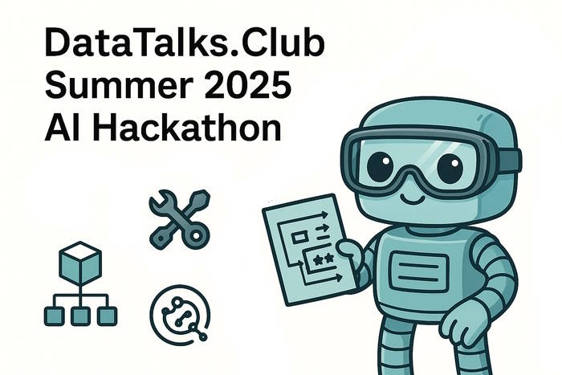

# DataTalks.Club Summer 2025 AI Hackathon

<p align="center">
  
</p>

[](https://datatalks.club)
[](https://github.com/DataTalksClub/llm-zoomcamp)

> Build with LLMs for the Community

Welcome to the DataTalks.Club Summer 2025 AI Hackathon! This is your opportunity to apply your LLM knowledge to create impactful tools for the DataTalks.Club community.

## Getting Started

1. Join the `#hackathon` channel in [Slack](https://datatalks.club/slack.html)
2. Form your team or indicate you're looking for teammates
3. Start brainstorming project ideas
4. Submit [this form](https://airtable.com/appjxMzaGej3KHwEh/shr12Sx3SGsStvjEd) with your idea so we can review it and add to the list of project ideas
5. Attend our Hackathon Launch Stream ([sign up here](https://lu.ma/i98j574k))
6. Begin planning and development

## Quick Links

- [Submit your idea](https://airtable.com/appjxMzaGej3KHwEh/shr12Sx3SGsStvjEd)
- [Join discussion and find a team](https://datatalks.club/slack.html) (#hackathon channel)
- [LLM Zoomcamp course materials](https://github.com/DataTalksClub/llm-zoomcamp)
- [Hackathon Launch Stream](https://lu.ma/i98j574k)

## About the Hackathon

This hackathon is a 9-10 week project-building experience where you'll create an application powered by Large Language Models (LLMs). Think of it as an extended capstone project where you have the time to:

- Thoroughly research and plan your solution
- Implement and test your ideas
- Get feedback from the community
- Polish your project for production readiness

This hackathon is designed to give you real-world experience in building LLM-powered applications.

## Why Join?

- **Hands-on Practice**: Put your LLM Zoomcamp knowledge to work by building real-world applications that solve actual community needs
- **Career Portfolio**: Build a comprehensive portfolio piece including:
  - Production-ready codebase
  - Technical documentation
  - Demo video
  - Published article
  - Public presentation experience
- **Community Impact**: Create tools that will help fellow learners and contribute to the DataTalks.Club ecosystem
- **Valuable Prizes**: Earn AWS credits and bonus course points while gaining recognition in the community
- **Learning Experience**: Challenge yourself to:
  - Work with cutting-edge LLM technology
  - Collaborate with peers
  - Improve your technical communication skills

## Timeline

| Phase | Dates | Details |
|:------|:------|:--------|
| **Hackathon Launch** | July 14, 2025 (Mon) | We will review project ideas and answer your questions. |
| **Build Sprint** | Mid-July - Mid-September | Nine-week window where you'll work on your projects. We'll have weekly office hours to help you and regular check-ins to track progress. |
| **Final Submission** | September 15, 2025 23:59 CET | Submit your completed project including the demo video, GitHub repository, and article. |
| **Demo Week** | September 22-26, 2025 | Selected teams will present their projects live. Our panel of judges will evaluate the submissions and announce winners during the closing ceremony. |

## Team Formation

### Team Structure
- Work solo or form a team of up to 4 members
- Each team must have a designated team lead
- You are not required to be LLM Zoomcamp student to participate in the hackathon

#### Finding Teammates
Join the `#hackathon` channel in Slack and write a short message there.

Here's an example of what you can write:
```
Looking for Team/Members for the hackathon.

- Your Name:
- Time Zone:
- Skills: (e.g., Python, LLMs, Frontend, etc.)
- Interests: (what kind of project you want to build)
- Availability: (how many hours/week you can commit)
- GitHub/LinkedIn: (optional)
```
## Project Ideas

Here are some inspiring project possibilities:

- **Course study notes:** Convert course videos into organized notes, complete with annotated screenshots or diagrams
- **Glossary:** Extract key terms from course materials, define them, and link each entry back to the exact lesson where it appears
- **Smart search:** Build an LLM-powered search interface that indexes both your notes and glossary. It should provide accurate, context-aware results, enabling users to locate information across both sources.
- **Note-to-article generator:** An app that transforms course notes into complete, publishable articles.
- **Podcast article generator:** Turn podcast transcripts into engaging articles by extracting the main points — raw transcripts are often too tedious to read.
- **Webinar and workshop articles:** Summarize and structure key content from live sessions into blog-style writeups.
- **Slack-powered FAQ enhancer:** Enrich course FAQs by incorporating relevant Q&As drawn from Slack discussions.
- **Automated project grader:** Automatically grade course projects based on the course evaluation criteria
- **Listicle builder:** Create an app that curates and updates themed lists of courses, articles, or resources for any selected date range.

Feel free to build on any of these ideas or come up with your own. The only requirement is that your project involves LLMs and brings value to learners and the community.

> Have a different idea? [Submit it here](https://airtable.com/appjxMzaGej3KHwEh/shr12Sx3SGsStvjEd) for review and potential addition to this list!

## Available Resources

You'll have access to a comprehensive set of community materials:

### Course Content
- Complete video lectures with transcripts
- Course notebooks and code examples
- Assignment materials and solutions
- Project examples and evaluations

### Community Data
- Public Slack discussions
- Community-written articles
- GitHub repositories
- Previous project submissions

You can also use any other public data that you can find.

## Submission Requirements

### 1. Demo Video (2-3 minutes)
Required elements:
- Problem statement and motivation
- Solution overview and architecture
- Live demonstration of key features
- Technical implementation highlights
- Future development plans

Recommended tools: Loom, Zoom recording, or similar screen recording software

### 2. Project Repository
Your GitHub repository must include:
- Complete source code
- Comprehensive README.md
  - Project overview
  - Installation instructions
  - Usage guide
  - API documentation (if applicable)
  - Development setup guide
- Requirements.txt or equivalent
- License file
- Contributing guidelines

### 3. Technical Article (800-1,200 words)
Structure your article to include:
- Problem definition and motivation
- Solution architecture
- Technical implementation details
- Model selection and optimization
- Evaluation methodology
- Results and analysis
- Lessons learned
- Future improvements

## Evaluation Criteria

Projects will be assessed based on:

| Criterion | Description | Weight | Key Aspects |
|:----------|:------------|:-------|:------------|
| **Impact** | Community value and problem-solving effectiveness | 40% | - Problem importance<br>- Solution effectiveness<br>- User experience<br>- Potential adoption |
| **Implementation** | Code quality and technical execution | 40% | - Code organization<br>- Performance<br>- Scalability<br>- Best practices |
| **Communication** | Clear presentation and documentation | 20% | - Demo quality<br>- Documentation<br>- Article clarity<br>- Technical explanation |

## Jury Panel

Our distinguished panel of judges includes:

- **Alexey Grigorev**: DataTalks.Club Founder
- **Timur Kamaliev**: DataTalks.Club Course Instructor & TA
- **Valeriia Kuka**: DataTalks.Club Content Manager
- Additional industry experts to be announced

## Prizes

### First Place
- $250 AWS credits per team member
- Featured presentation at community livestream
- Project spotlight on DataTalks.Club platforms
- Special mention in newsletter
- Certificate of achievement

### Runners-up
- $100 AWS credits per team member
- Project showcase in community channels
- Recognition in DataTalks.Club blog
- Certificate of participation

### All Participants
- LLM Zoomcamp bonus points
- Portfolio-ready project
- Community recognition
- Participation certificate

## Questions?

Post in the `#hackathon` channel in [Slack](https://datatalks.club/slack.html)

### FAQ

- **Q:** So if someone participates in the hackathon, will it count as a capstone project for LLM Zoomcamp?
- **A:** No, a project and a hackathon are two separate things. You work on the project alone and it has to satisfy the pre-defined criteria. For the hackathon, you work in teams and you don't have any strict criteria to satisfy. 


---
*Last updated: July 2025*
