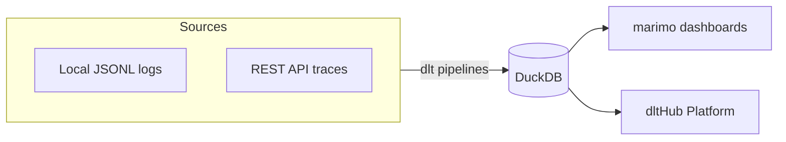

# Overview and setup

## The app you'll build

Every time you use a coding agent like Claude Code, Codex, or Copilot,
it stores metadata about every session on your laptop. The logs live in
places like `~/.claude/projects/` as JSONL files, one JSON object per
line. They contain usage data, token counts, model names, tool calls -
valuable data trapped in an awkward nested format.

In this workshop, taught by Alena Astrakhantseva from dltHub, we turn
those logs into structured tables and dashboards. We do it with dlt and
the dltHub AI workbench, which lets a coding agent build pipelines from
natural-language prompts.

By the end you'll have:

1. A dlt pipeline loading local Claude Code logs into DuckDB.
2. A marimo dashboard over that data with activity, models, tokens, and
   projects.
3. A REST API pipeline pulling agent traces from a hosted API.
4. A scheduled deployment on the dltHub Platform with a shareable
   dashboard.

The architecture looks like this:



## Prerequisites

You'll need these accounts and tools:

- Python 3.11 or later
- [uv](https://docs.astral.sh/uv/) package manager
- A coding agent: Claude Code, Codex, or Copilot
- A dltHub Platform account (free): [app.dlthub.com](https://app.dlthub.com/)
- Some local agent logs so `~/.claude/projects/` has JSONL files
  to load, and if you don't have any yet, use your agent for a bit
  and come back.

## Scaffold the workspace

The dltHub AI workbench has its own scaffolding command, so run it in an
empty folder:

```bash
uvx dlthub-init@latest
```

This creates a workspace with `pyproject.toml`, a `.dlt/` config
directory, `.claude/` skills, and `.mcp.json` for the MCP server.
It also creates `__deployment__.py` for cloud deployment and a
virtual environment.
a virtual environment.

When it asks to create a virtual environment and install dependencies,
say yes. It runs `uv sync` for you.

## Open the workspace in your agent

Open the scaffolded folder in your coding agent. The agent reads the
router skill and dispatches to the right toolkit when you ask it to
build a pipeline.

Confirm the workbench is running:

```bash
uv run dlthub ai status
```

DuckDB is our destination for local development. It's an in-process
analytical database - no server to run, dlt writes to a `.duckdb` file
on disk. No extra setup is needed because DuckDB comes as a dependency
of dlt.

[Filesystem pipeline →](02-filesystem-pipeline.md)
